# Wide Gamut Test Images

This repository contains a series of wide-gamut test images. The images are prefixed with the color space of the embedded profile.

## Methodology

The primary purpose of these images is to provide simple test images for checking to see how different rendering technology is affected by non-sRGB color gamuts. For these tests, the embedded color profile keeps the same whitepoint and gamma values as the source sRGB image to reduce color and brightness variations in the output images.

## Process

These images were created via the following process:
* Configure Photoshop to Preserve Color Profiles and to always ask when opening, pasting, or if there is a missing profile.
* Create a solid color or gradient in the "Target" color space (P3 or R2020)
* Copy the solid color or gradient into a document that's in sRGB space and convert the colors to the the "Source" space (sRGB) using the "Preserve Color Appearance" option.
  * Engine: "Adobe (ACE)"
  * Intent: "Absolute Colormetric"
* Copy the the source version back to the original image using the "Preserve Color Appearance" option.
* Create a layer mask so that differences are visible.
* Save the images as a jpeg with the "Target" color space.

## sRGB Source Specs

This is the profile information for the source color space.  These values were pulled from the [wikipedia article on sRGB](https://en.wikipedia.org/wiki/SRGB).

| Profile | Wx| Wy| Rx| Ry| Gx| Gy| Bx| By |
|---------|--------|--------|-------|-------|-------|-------|-------|-------|
| sRGB    | 0.3127 | 0.3290 | 0.640 | 0.330 | 0.300 | 0.600 | 0.150 | 0.060 |

The gamma value is set to 2.200

## DCI-P3

P3 prefixed images were created using a manually entered DCI-P3 profile with a D65 whitepoint. These values were pulled from the [wikipedia article on DCI-P3](https://en.wikipedia.org/wiki/DCI-P3).

| Profile | Wx| Wy| Rx| Ry| Gx| Gy| Bx| By |
|------------|--------|--------|-------|-------|-------|-------|-------|-------|
| DCI-P3 D65 | 0.3127 | 0.3290 | 0.680 | 0.320 | 0.265 | 0.690 | 0.150 | 0.060 |

The gamma value is set to 2.200

### Images

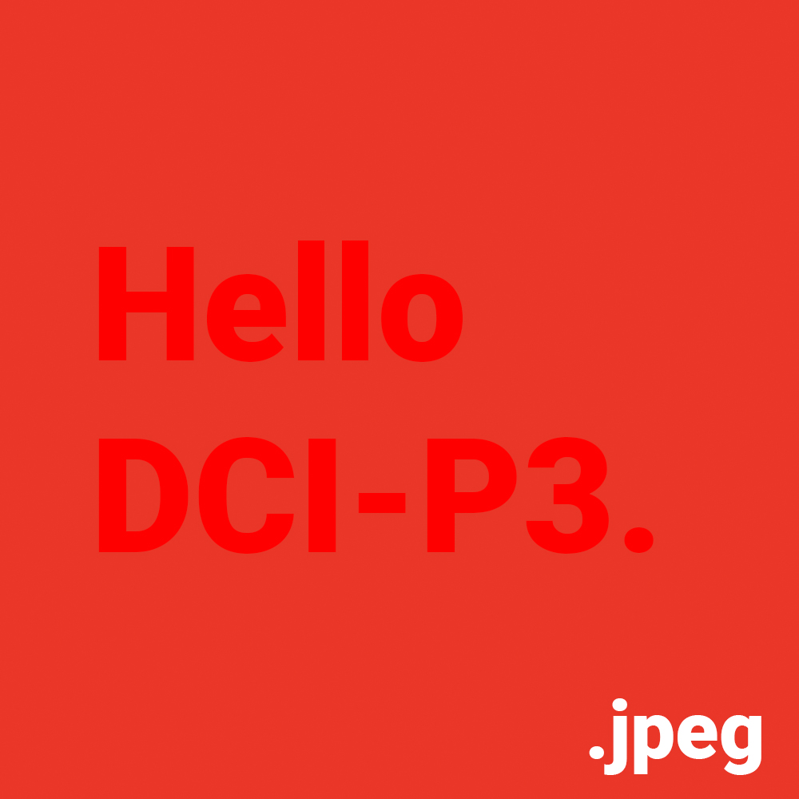
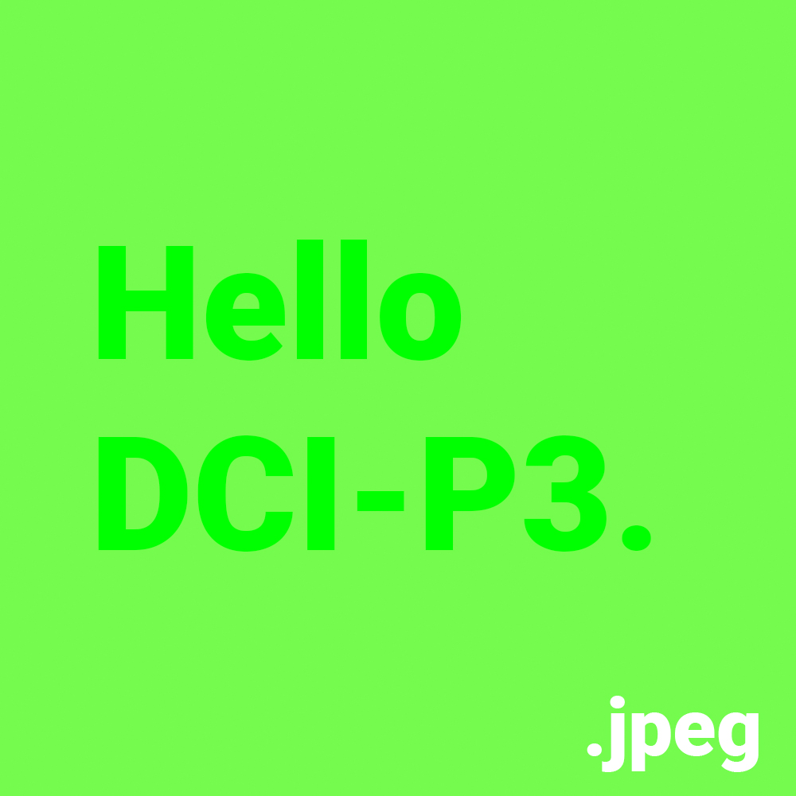
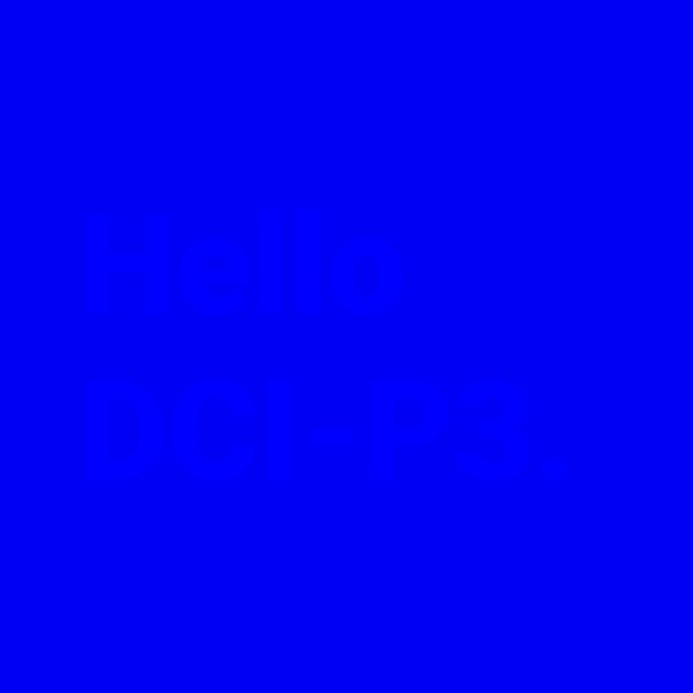
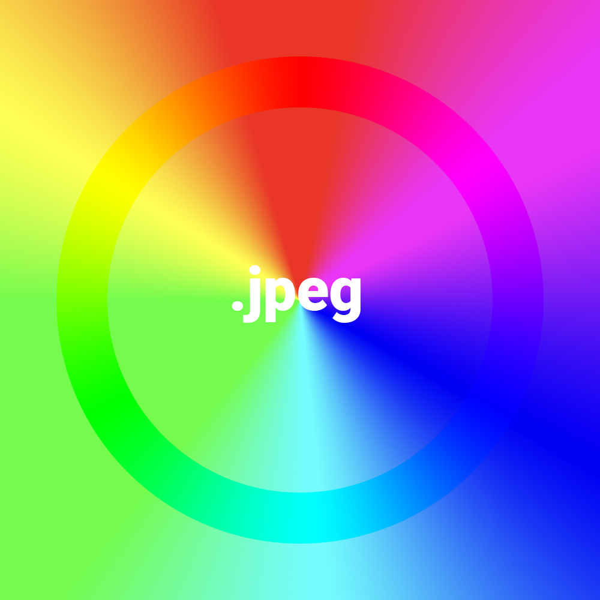
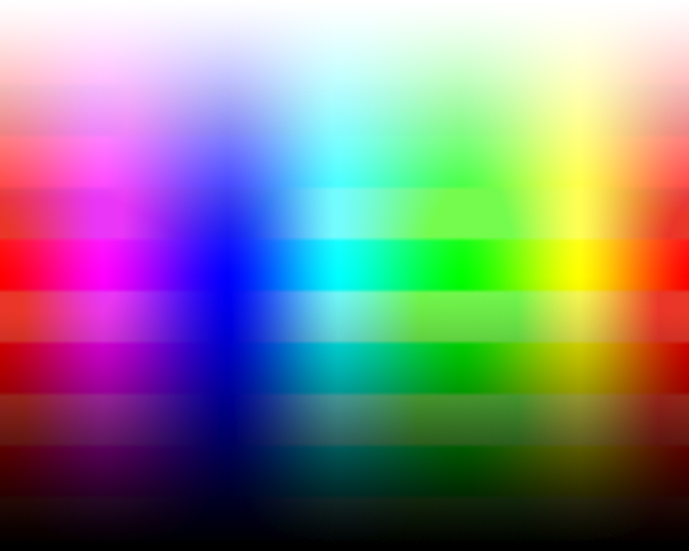

## Rec. 2020

R2020 prefixed images were created using a manually entered R2020 profile with a D65 whitepoint. These values were pulled from the [wikipedia article on Rec. 2020](https://en.wikipedia.org/wiki/Rec._2020).

| Profile | Wx| Wy| Rx| Ry| Gx| Gy| Bx| By |
|---------------|--------|--------|-------|-------|-------|-------|-------|-------|
| ITU-R BT.2020 | 0.3127 | 0.3290 | 0.708 | 0.292 | 0.170 | 0.797 | 0.131 | 0.046 |

The gamma value is set to 2.200

### Images

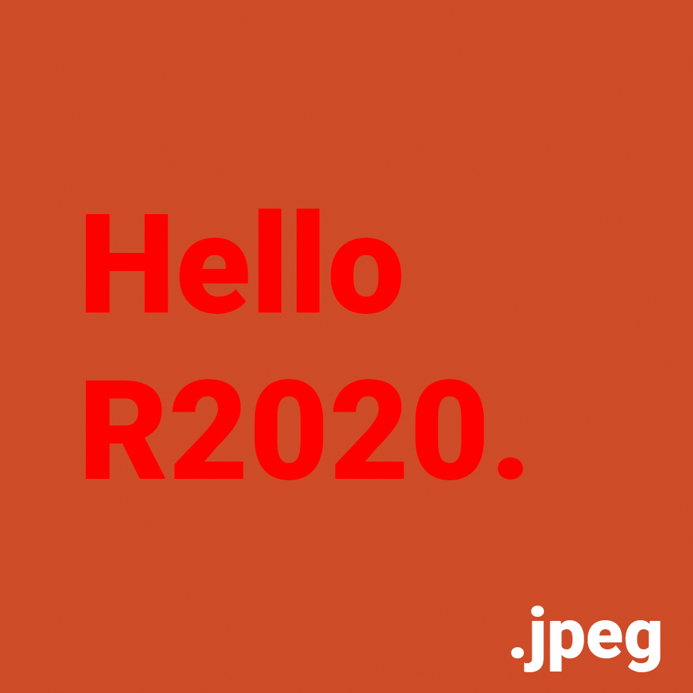
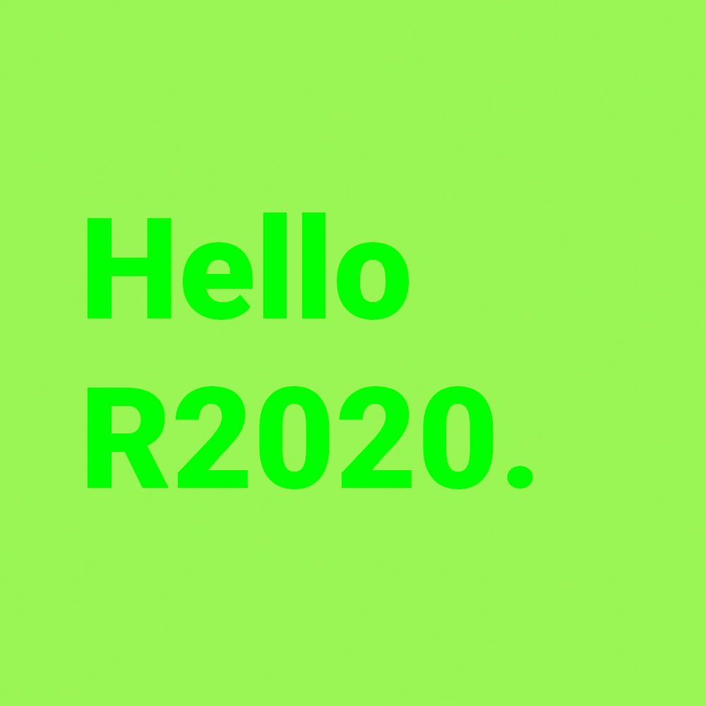
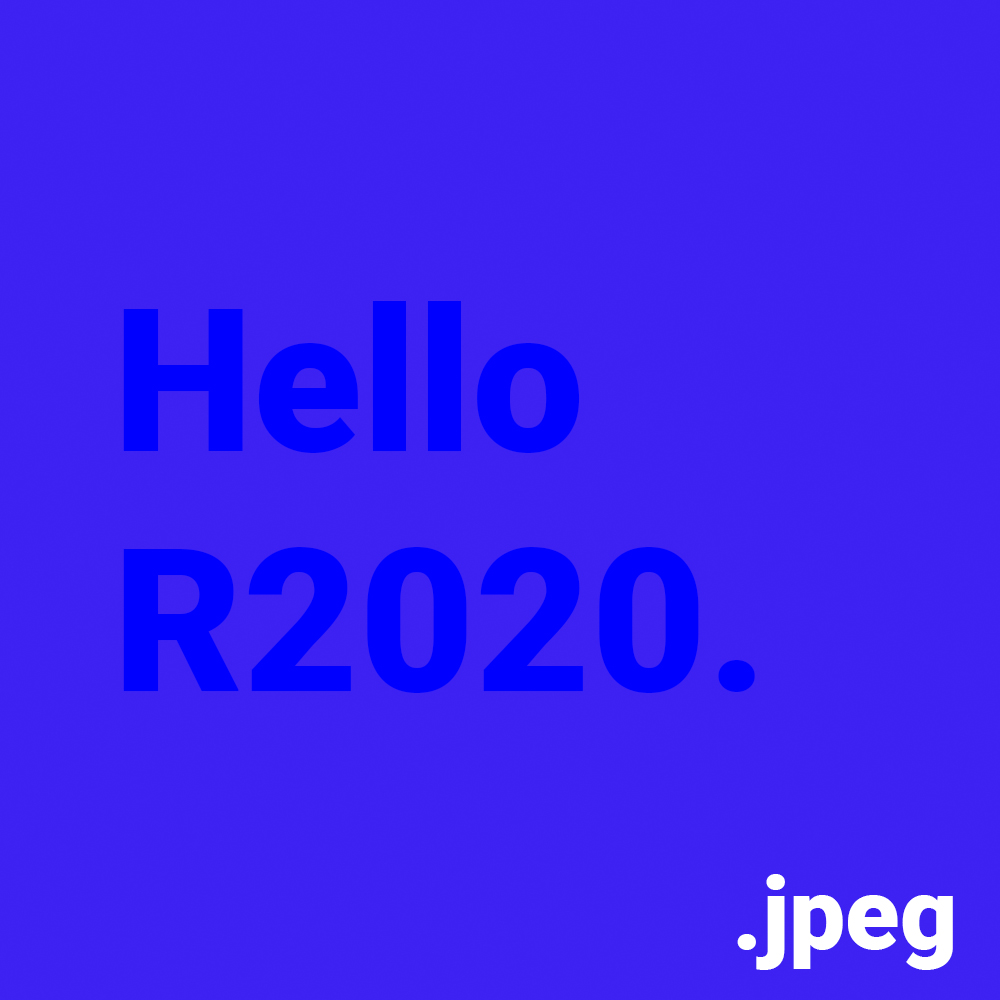
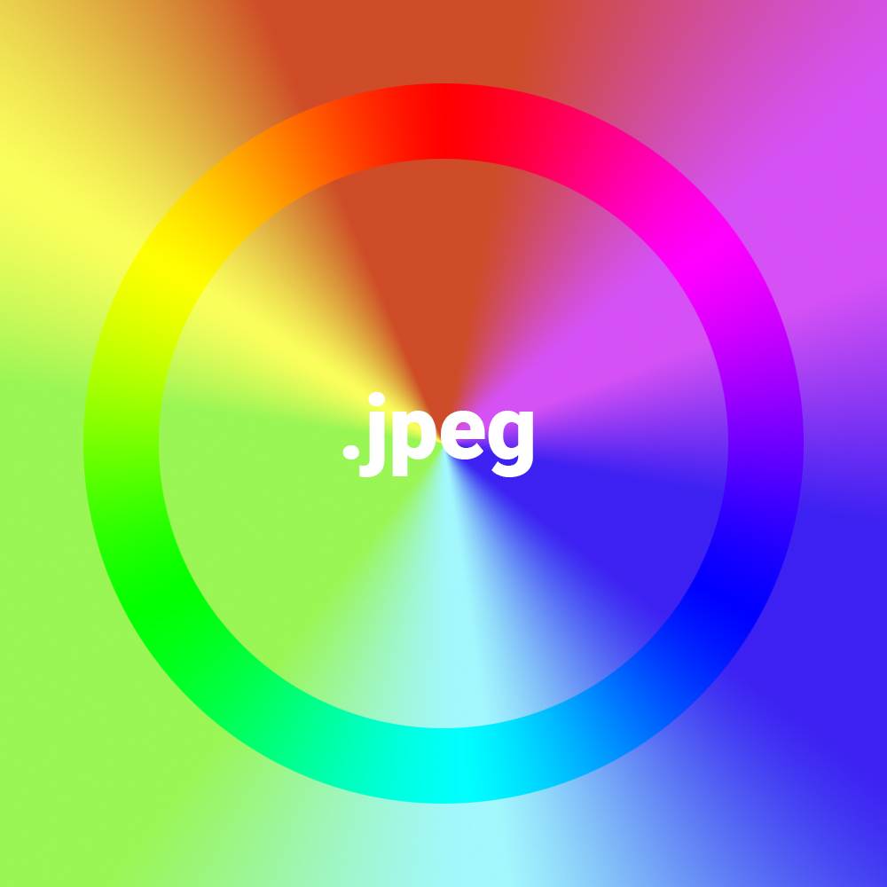
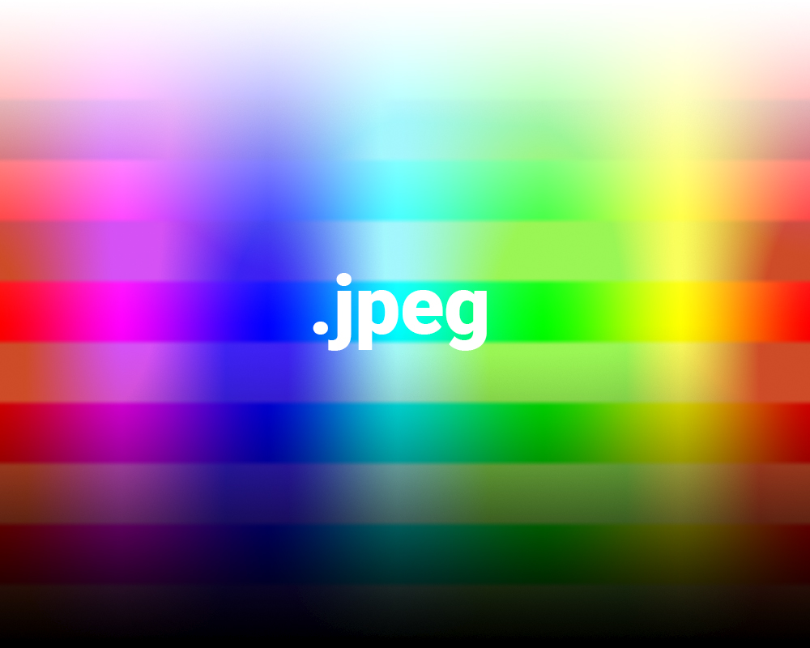

## RGB to GBR

This test image was created by assigning a custom profile that rotates the RGB primary color points from the original sRGB color profile. Red -> Green, Green -> Blue, Blue -> Red

| Profile | Wx| Wy| Rx| Ry| Gx| Gy| Bx| By |
|------------|--------|--------|-------|-------|-------|-------|-------|-------|
| RGB to GBR | 0.3127 | 0.3290 | 0.150 | 0.060 | 0.640 | 0.330 | 0.300 | 0.600 |

If the words and colors are aligned, then the profile was processed correctly.

### Images

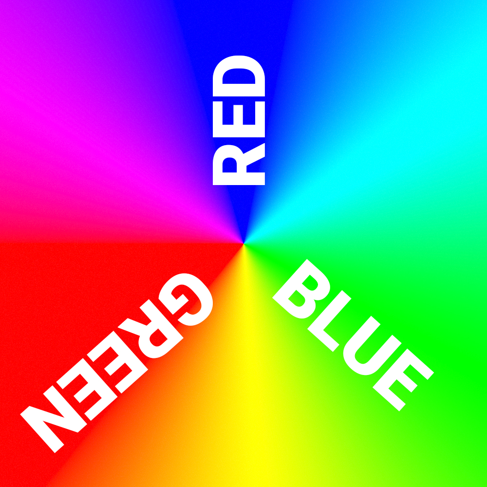
